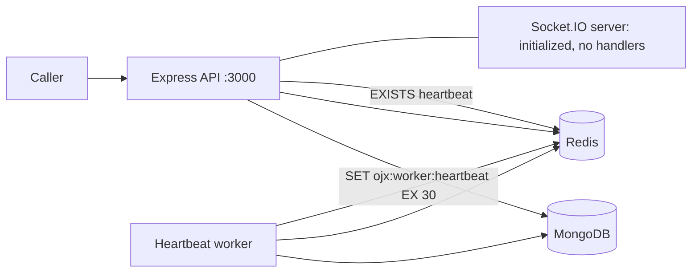
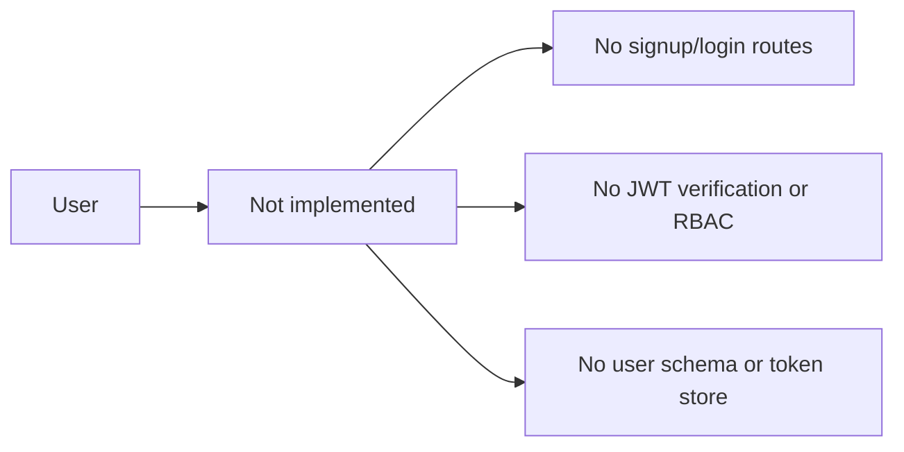
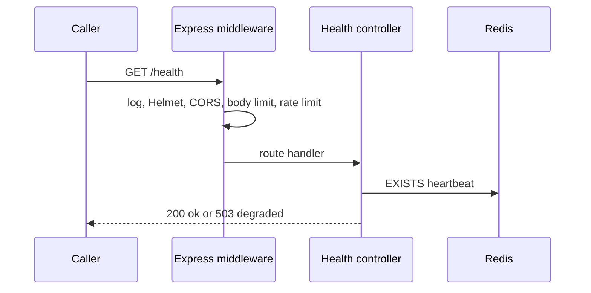
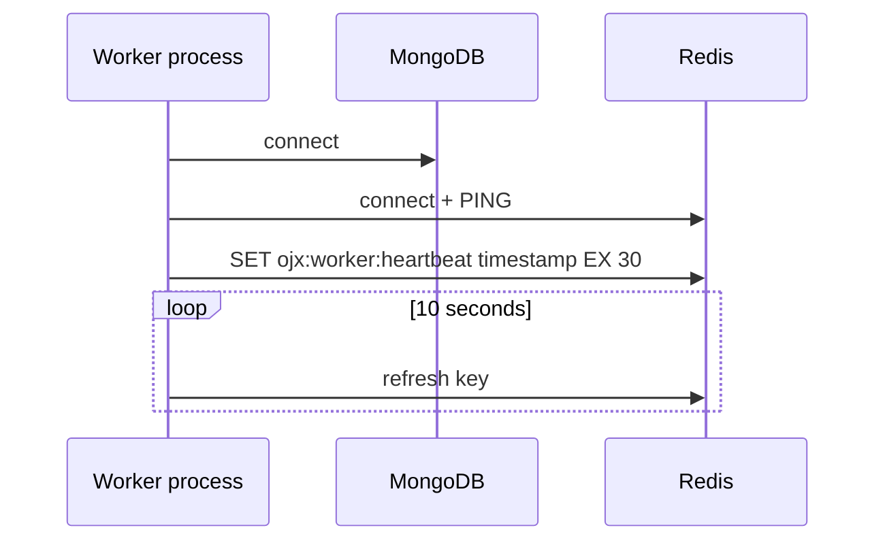
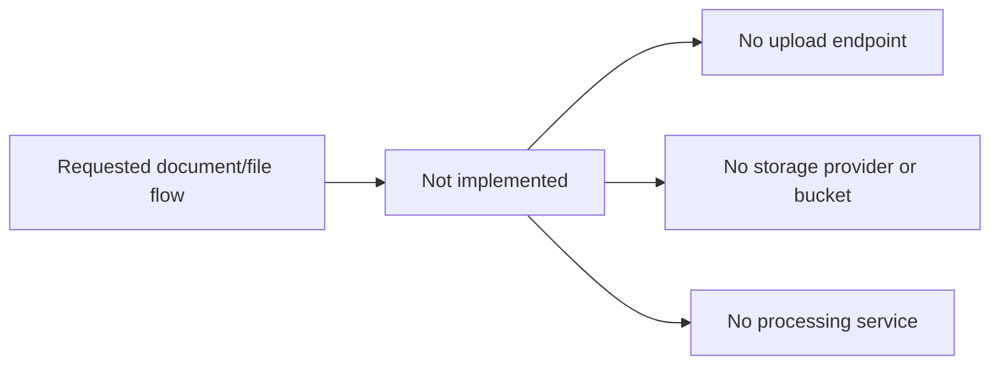
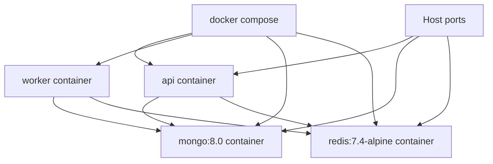

# Architecture Diagrams

All diagrams label whether they depict current implementation or an absent flow. They do not turn planned dependencies into implemented features.

## 1. Current system architecture



## 2. Authentication flow



`JWT_SECRET` and `JWT_EXPIRES_IN` exist in configuration, but no request currently uses them.

## 3. Current API flow



All non-health paths receive a JSON 404. Errors receive the generic JSON error response.

## 4. Database flow

```mermaid
flowchart LR
  Server --> Connect[mongoose.connect(MONGODB_URI)] --> Mongo[(MongoDB)]
  Worker --> Connect
  Health --> State[mongoose.connection.readyState]
  State --> Response[/health/db response]
```

There are no model, collection, read, write, migration, or transaction flows.

## 5. Worker flow



BullMQ is not imported or initialized, so there is no job flow.

## 6. Document processing / file storage flow



## 7. Deployment architecture



This is a local development deployment, not a secure production topology: MongoDB and Redis are mapped to host ports, images use tags rather than digests, and API/worker lack Compose health checks.
