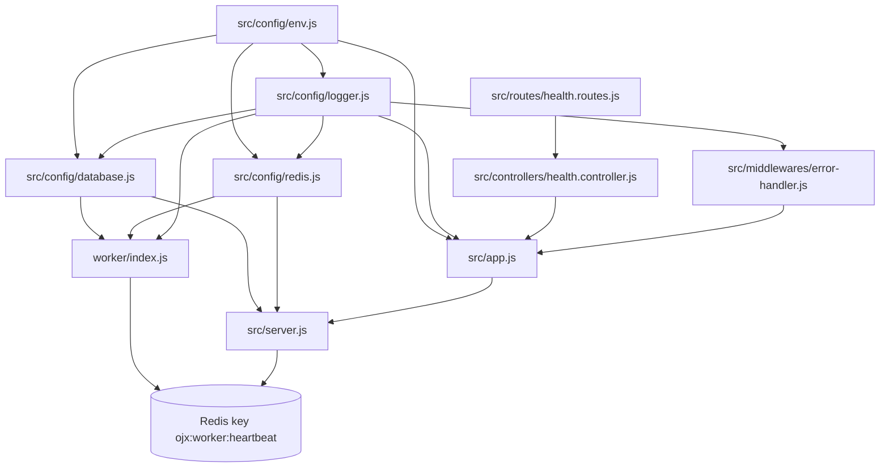
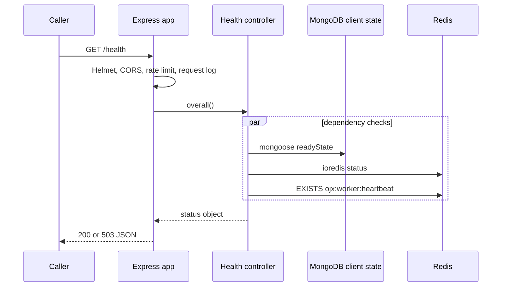
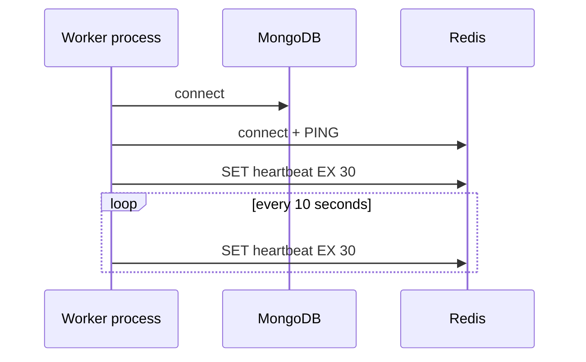

# How OJX Works Today

This document describes the **implemented repository**, not the planned online-judge product. The current codebase is a backend foundation. There is no browser application, authentication route, dashboard, domain API, database model, file upload path, queue processor, AI integration, or code-execution sandbox.

## Module dependency map

## User journey

There is no web client, login flow, user dashboard, or user business action in the current codebase. The only user-facing journey is a caller requesting a health endpoint.

1. A caller sends `GET /health` (or a component-specific health route) to the Express server.
2. `src/app.js` applies request logging, Helmet headers, CORS, JSON parsing, and the global rate limiter.
3. `src/routes/health.routes.js` invokes a controller generated by `createHealthController`.
4. The controller calls three injected probes concurrently: MongoDB connection state, Redis client state, and whether the Redis worker-heartbeat key exists.
5. It returns HTTP 200 with `status: ok` only when all three probes are healthy; otherwise it returns 503 with component statuses.
6. Unmatched routes return a JSON 404. Exceptions route to the structured error handler.

## Process startup

The API process starts through `src/server.js`. It connects MongoDB and Redis concurrently, creates the Express app with live probes, attaches Socket.IO to the HTTP server, and listens on `PORT`. Socket.IO is instantiated but has no events, rooms, middleware, or authentication configured.

The worker starts through `worker/index.js`. It connects to MongoDB and Redis, creates/refreshes `ojx:worker:heartbeat` every ten seconds with a 30-second TTL, and logs readiness. It does not consume a BullMQ queue or execute work.

## Major feature matrix

| Feature | Actual state | API / collection / service involved |
|---|---|---|
| Website/frontend | Not present | No frontend folder or client API calls |
| Registration/login/dashboard | Not present | No auth routes, user model, session, or JWT use |
| Health reporting | Implemented | `GET /health*`; Mongoose state, ioredis state, worker heartbeat |
| MongoDB persistence | Connectivity only | No models, collections, reads, or writes |
| Redis | Implemented for connectivity and heartbeat only | `ojx:worker:heartbeat`; no cache/queue data |
| BullMQ queues | Not implemented | Dependency exists; `src/queues` is empty placeholder |
| Code judging | Not implemented | `worker/runners` and `worker/processors` are empty placeholders |
| File storage | Not present | No SDK, route, bucket, or filesystem flow |
| AI/ML | Not present | No provider, prompt, model, or pipeline |
| Socket.IO messaging | Initialized only | No event registration or emission |

## Database interactions

`connectDatabase` opens a Mongoose connection. `databaseHealth` reads `mongoose.connection.readyState`. No Mongoose schemas/models exist, so the API and worker do not persist any data. The collections listed in `docs/data-model.md` are a roadmap and are not created by code.

## Authentication and authorization

`jsonwebtoken` and `bcryptjs` are dependencies and environment variables are defined for JWT configuration. Neither package is imported outside `package.json`; no authentication or authorization behavior exists.

## File storage and AI/ML

There is no file-storage implementation and no AI/ML implementation in the source tree. No flow can be documented without inventing behavior.
