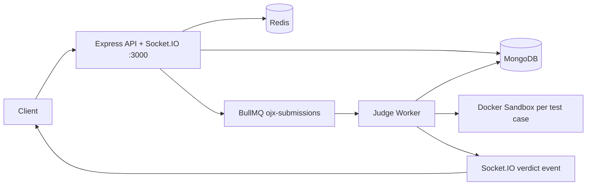

# OJX

OJX is a Node.js distributed online judge platform. It supports user authentication with RBAC, problem management, code submissions judged inside isolated Docker containers, real-time verdict delivery via Socket.IO, and a BullMQ-based submission pipeline.

## Implemented Features

- **Auth & RBAC** — JWT access tokens (15m) + httpOnly refresh tokens (7d), bcrypt password hashing, token rotation, Redis denylist on logout, role-based middleware (`user` / `admin`).
- **Problem Management** — Problem CRUD with private test cases (never exposed in API), public examples, difficulty/tags/status, paginated listing with filters.
- **Submission Pipeline** — BullMQ queue (`ojx-submissions`) with idempotent job IDs, exponential backoff retries, and a worker processor that runs code against every test case.
- **Docker Sandbox** — Each test case runs in an ephemeral container: no network (`NetworkDisabled`), CPU quota (0.5 CPU), memory limit, PID limit 50, `no-new-privileges`. Container is always force-removed on completion or error.
- **Supported Languages** — C++17 (gcc:13-alpine), Python 3 (python:3.12-alpine), JavaScript (node:20-alpine).
- **Real-time Verdicts** — Socket.IO pushes `verdict` events to `user:<userId>` rooms when judging finishes. Requires JWT in `socket.handshake.auth.token`.
- **Verdict States** — `queued → running → accepted | wrong_answer | time_limit_exceeded | memory_limit_exceeded | runtime_error | compilation_error | internal_error`.
- **Security** — Helmet, CORS, Redis-backed rate limiting (global 100/15min, auth 10/15min), 1MB body limit, Zod request validation on all routes.
- **Health Endpoints** — `/health`, `/health/db`, `/health/redis`, `/health/worker` (uses per-worker heartbeat key).
- **Graceful Shutdown** — SIGTERM/SIGINT drains HTTP server, closes Socket.IO, BullMQ worker, Mongoose, Redis connections with a 10s timeout.
- **CI/CD** — GitHub Actions: lint, test, coverage, Docker build smoke test, `npm audit`.

## Architecture



## Requirements

- Node.js 20.11+ and npm
- Docker Desktop with Docker Compose (required for MongoDB, Redis, and sandbox execution)

## Quick Start

```bash
cp .env.example .env
# Edit .env — set JWT_SECRET and REFRESH_TOKEN_SECRET to long random strings

npm ci
docker compose up --build
```

The API listens on `http://localhost:3000`.

## Configuration

| Variable | Purpose |
|---|---|
| `NODE_ENV` | `development`, `test`, or `production` |
| `PORT` | API listen port (default 3000) |
| `MONGODB_URI` | MongoDB connection URI |
| `REDIS_URL` | Redis connection URI |
| `JWT_SECRET` | Access token signing secret (min 32 chars; **required** in production) |
| `JWT_EXPIRES_IN` | Access token TTL (default `15m`) |
| `REFRESH_TOKEN_SECRET` | Refresh token signing secret (min 32 chars; **required** in production) |
| `REFRESH_TOKEN_EXPIRES_IN` | Refresh token TTL (default `7d`) |
| `CORS_ORIGIN` | Comma-separated allowed origins |
| `RATE_LIMIT_WINDOW_MS` / `RATE_LIMIT_MAX` | Global rate limit policy |

## API Reference

### Auth
| Method | Endpoint | Auth | Description |
|---|---|---|---|
| `POST` | `/auth/signup` | — | Register a new user |
| `POST` | `/auth/login` | — | Login, returns access token + sets refresh cookie |
| `POST` | `/auth/refresh` | Cookie | Rotate refresh token |
| `POST` | `/auth/logout` | Cookie | Revoke refresh token |
| `GET` | `/auth/me` | Bearer | Current user |

### Problems
| Method | Endpoint | Auth | Description |
|---|---|---|---|
| `GET` | `/problems` | — | List published problems (paginated, filterable) |
| `GET` | `/problems/:slug` | — | Single problem (no private test cases) |
| `POST` | `/problems` | Admin | Create problem |
| `PUT` | `/problems/:slug` | Admin | Update problem |

### Submissions
| Method | Endpoint | Auth | Description |
|---|---|---|---|
| `POST` | `/submissions` | Bearer | Submit code for judging |
| `GET` | `/submissions` | Bearer | List own submissions |
| `GET` | `/submissions/:id` | Bearer | Get submission + verdict |

### Health
| Method | Endpoint | Description |
|---|---|---|
| `GET` | `/health` | Overall status |
| `GET` | `/health/db` | MongoDB status |
| `GET` | `/health/redis` | Redis status |
| `GET` | `/health/worker` | Worker heartbeat status |

## Socket.IO

Connect with a valid access token to receive real-time verdicts:

```javascript
const socket = io('http://localhost:3000', {
  auth: { token: '<ACCESS_TOKEN>' }
});

socket.on('verdict', ({ submissionId, status, score, executionTime, results }) => {
  console.log(`Submission ${submissionId}: ${status} (score: ${score}%)`);
});
```

## Testing

```bash
npm run lint          # ESLint — 0 errors expected
NODE_ENV=test npm test            # 27 tests across 5 suites
npm run test:coverage # Coverage report
```

## Making a User Admin

By default all users get the `user` role. To promote to admin via MongoDB shell:

```js
db.users.updateOne({ email: 'you@example.com' }, { $set: { role: 'admin' } })
```

## Postman Collection

[postman/OJX-Phase-1.postman_collection.json](postman/OJX-Phase-1.postman_collection.json)

## License

MIT
