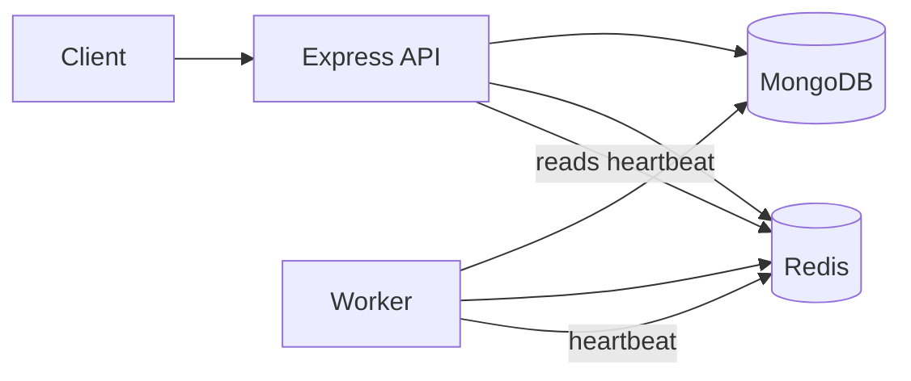

# OJX

OJX is a Node.js foundation for a future distributed online judge. The current repository implements an Express API shell, MongoDB and Redis connectivity, health reporting, structured logging, a worker heartbeat, and Docker Compose development infrastructure. It does **not** yet implement user accounts, submissions, judging, queues, problem management, or a frontend.

## Implemented features

- Express API with Helmet, CORS, JSON request-size limit, and global rate limiting.
- Zod-validated runtime configuration.
- MongoDB and Redis connection helpers.
- `/health`, `/health/db`, `/health/redis`, and `/health/worker` endpoints.
- Pino request/error logging.
- A separate worker process publishing a Redis liveness heartbeat.
- Docker Compose services for MongoDB, Redis, API, and worker.
- Jest/Supertest coverage for health routes.

## Architecture



The intended future architecture is documented separately from the implementation in [docs/architecture.md](docs/architecture.md). See [ARCHITECTURE_REVIEW.md](ARCHITECTURE_REVIEW.md) for the current-state audit.

## Requirements

- Node.js 20.11 or later and npm
- Docker Desktop with Docker Compose (recommended for MongoDB and Redis)

## Installation and local run

```bash
cp .env.example .env
npm install
docker compose up --build
```

Compose supplies the internal `mongo` and `redis` hostnames automatically. To run API and worker directly on the host, set `MONGODB_URI=mongodb://localhost:27017/ojx` and `REDIS_URL=redis://localhost:6379` in `.env`, start those services, then run:

```bash
npm run dev
npm run worker
```

## Configuration

| Variable | Purpose |
|---|---|
| `NODE_ENV` | `development`, `test`, or `production` |
| `PORT` | API listen port |
| `MONGODB_URI` | MongoDB connection URI |
| `REDIS_URL` | Redis connection URI |
| `JWT_SECRET` / `JWT_EXPIRES_IN` | Reserved for future authentication; not currently used |
| `CORS_ORIGIN` | Comma-separated allowed browser origins |
| `RATE_LIMIT_WINDOW_MS` / `RATE_LIMIT_MAX` | Global in-memory API rate-limit policy |

## API documentation

| Method | Endpoint | Description |
|---|---|---|
| `GET` | `/health` | Overall API dependency status |
| `GET` | `/health/db` | MongoDB connection status |
| `GET` | `/health/redis` | Redis connection status |
| `GET` | `/health/worker` | Worker heartbeat status |

The Postman collection is [postman/OJX-Phase-1.postman_collection.json](postman/OJX-Phase-1.postman_collection.json).

## Testing

```bash
npm test
npm run lint
npm run test:coverage
```

## Deployment status

The Compose configuration is suitable for local development only. It exposes MongoDB and Redis host ports and has no TLS, secrets manager, production image lockfile, container health checks for API/worker, CI/CD, or external monitoring. See the production checklist before any deployment.

## Screenshots

_Placeholder: API health response screenshot._

_Placeholder: future judge dashboard screenshot._

## Future improvements

Authentication/RBAC, persistence schemas, queue processors, sandboxed execution, Socket.IO authorization, observability, CI/CD, and deployment hardening are outstanding. The concrete work is prioritized in [PRODUCTION_READY_CHECKLIST.md](PRODUCTION_READY_CHECKLIST.md).
