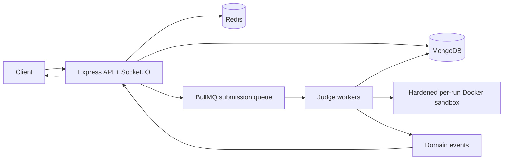

# OJX target architecture (not yet implemented)

This diagram is the intended target, not current behavior. The implemented repository only provides API/worker connectivity and a Redis worker heartbeat; it does not yet create BullMQ queues, judge workers, sandbox containers, domain events, or Socket.IO events. See [ARCHITECTURE_REVIEW.md](../ARCHITECTURE_REVIEW.md) for the current-state audit.

## Phase 1 decisions

- ES modules and Node 20 form the only runtime baseline.
- Dependencies are injected into health routes so the API remains testable without services.
- Health checks distinguish API availability from MongoDB, Redis, and worker availability.
- A single Docker image runs API or worker by command; deployments can scale them separately.

## Planned delivery sequence

1. Foundation: configuration, observability, security, health checks, Compose.
2. Identity and RBAC: users, JWT rotation, authentication tests.
3. Problem and discussion domains: validation, pagination, indexes, moderation.
4. Submission pipeline: schemas, BullMQ, event bus, runners, Docker sandbox, Socket.IO.
5. Contests, ratings, leaderboards, notifications, and analytics aggregations.
6. AI provider abstraction, plagiarism signals, admin APIs, deployment hardening.
