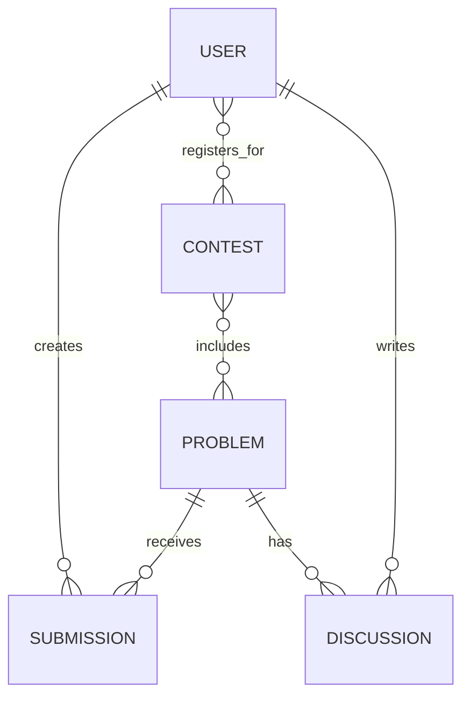
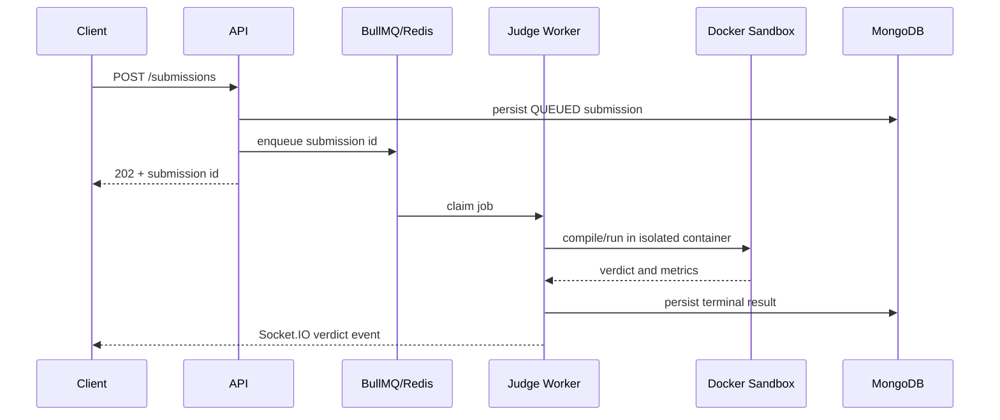
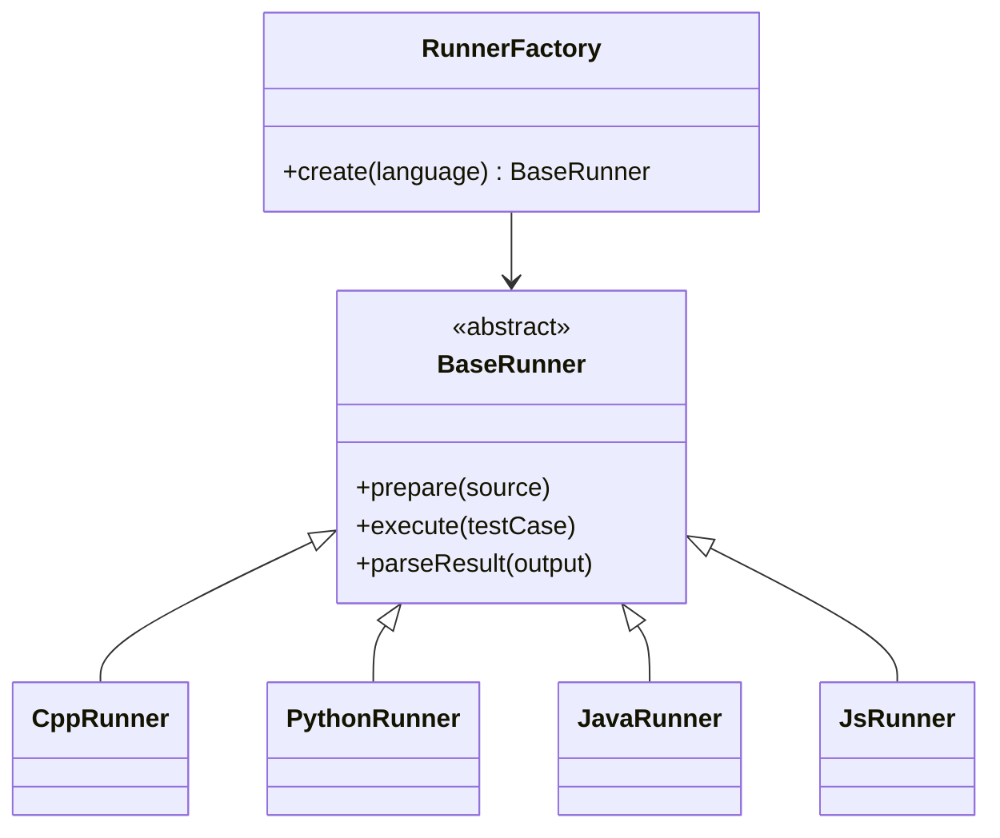

# Design diagrams

## ER diagram (target schema)

```mermaid
erDiagram
  USER ||--o{ SUBMISSION : creates
  PROBLEM ||--o{ SUBMISSION : receives
  CONTEST }o--o{ PROBLEM : includes
  USER }o--o{ CONTEST : registers_for
  PROBLEM ||--o{ DISCUSSION : has
  USER ||--o{ DISCUSSION : writes
```

## Submission sequence (Phase 4)

```mermaid
sequenceDiagram
  participant C as Client
  participant A as API
  participant Q as BullMQ/Redis
  participant W as Judge Worker
  participant D as Docker Sandbox
  participant M as MongoDB
  C->>A: POST /submissions
  A->>M: persist QUEUED submission
  A->>Q: enqueue submission id
  A-->>C: 202 + submission id
  Q->>W: claim job
  W->>D: compile/run in isolated container
  D-->>W: verdict and metrics
  W->>M: persist terminal result
  W-->>C: Socket.IO verdict event
```

## Runner class diagram (Phase 4)

```mermaid
classDiagram
  class BaseRunner {
    <<abstract>>
    +prepare(source)
    +execute(testCase)
    +parseResult(output)
  }
  class CppRunner
  class PythonRunner
  class JavaRunner
  class JsRunner
  class RunnerFactory { +create(language) BaseRunner }
  BaseRunner <|-- CppRunner
  BaseRunner <|-- PythonRunner
  BaseRunner <|-- JavaRunner
  BaseRunner <|-- JsRunner
  RunnerFactory --> BaseRunner
```
